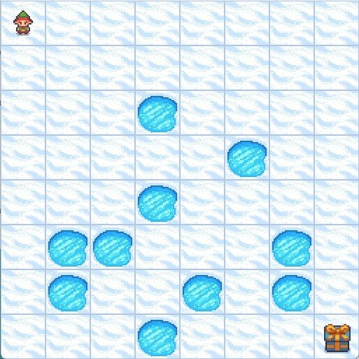

# Q-Learning with FrozenLake

In this project, we implement an agent using the Q-Learning algorithm to play FrozenLake, a stochastic environment provided by the Gymnasium library. The objective of the game is to navigate from the starting point to the goal, avoiding holes on a slippery, frozen lake.

## Overview

This project demonstrates the implementation of a reinforcement learning agent using the Q-Learning algorithm in the FrozenLake environment. The agent learns to navigate the lake by exploring different actions and updating its knowledge (Q-table) based on the rewards received.

### Key Components

1. **Environment Setup:**
   - The FrozenLake environment is created using the Gymnasium library. The map used is an 8x8 grid with the option to toggle the slipperiness of the ice.

2. **Q-Table Initialization:**
   - The Q-table, which stores the values of state-action pairs, is initialized. Depending on the mode (training or evaluation), the Q-table is either initialized to zeros or loaded from a file.

3. **Hyperparameters:**
   - Key hyperparameters for the Q-Learning algorithm are defined, including the learning rate (alpha), discount factor (gamma), exploration rate (epsilon), and its decay rate.

4. **Q-Learning Algorithm:**
   - The core of the project where the Q-Learning algorithm is implemented. The agent interacts with the environment, updates the Q-table, and learns the optimal policy over episodes.

5. **Training and Evaluation:**
   - The agent is trained over a specified number of episodes. During training, the Q-table is continuously updated. After training, the learned policy can be evaluated by running the agent in the environment.

6. **Visualization:**
   - The learning progress is visualized using plots to show the rewards over episodes. The Q-table is also saved for future use.

### Running the Project

1. **Install Dependencies:**
   - Ensure you have the required libraries installed. The primary dependency is Gymnasium, which can be installed via pip.

2. **Execute the Script:**
   - Run the main script to start training the agent. You can adjust the number of episodes and toggle between training and evaluation modes.

3. **Visualize Results:**
   - After training, visualize the learning progress and use the trained Q-table to see the agent play FrozenLake.

## Authors

- **Hassen Gadacha** - Étudiant en deuxième année d'ingénierie informatique à l'ENSI.

## License

This project is licensed under the MIT License - see the [LICENSE](LICENSE) file for details.
